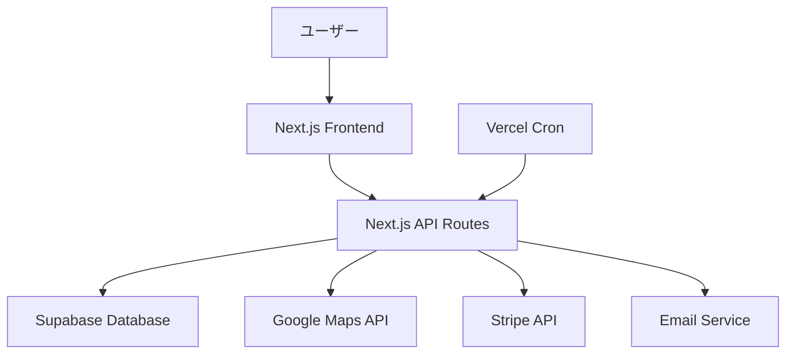

# MEO Watch アーキテクチャ設計

## システム概要

MEO Watch は、Google Maps検索順位の自動監視とSaaS型の課金機能を組み合わせたフルスタックWebアプリケーションです。Next.js 15のフルスタック機能を活用し、フロントエンドとバックエンドを統合した効率的なアーキテクチャを採用します。

## アーキテクチャパターン

- **パターン**: フルスタック Next.js アーキテクチャ（App Router + API Routes）
- **理由**:
  - 開発効率の最大化（単一コードベース）
  - Vercelでの最適化されたデプロイ
  - TypeScriptによる型安全性の統一
  - SSRとCSRのハイブリッド最適化

## コンポーネント構成

### フロントエンド
- **フレームワーク**: Next.js 15 (App Router)
- **UIライブラリ**: React 19
- **状態管理**: React Server Components + useState/useEffect
- **スタイリング**: Tailwind CSS 4
- **アニメーション**: Framer Motion
- **アイコン**: Lucide React
- **認証UI**: Supabase Auth UI Components

### バックエンド
- **フレームワーク**: Next.js 15 API Routes
- **認証方式**: Supabase Auth (JWT + RLS)
- **外部API連携**:
  - Google Maps API (Places, Geocoding)
  - Stripe API (決済処理)
- **バックグラウンド処理**: Vercel Cron Jobs

### データベース
- **DBMS**: Supabase (PostgreSQL 15+)
- **認証**: Supabase Auth (内蔵)
- **ストレージ**: Supabase Storage (CSVエクスポートファイル保存)
- **キャッシュ**: Redis (Upstash) - セッションとAPI制限管理

### インフラストラクチャ
- **デプロイ**: Vercel (Edge Runtime)
- **CDN**: Vercel Edge Network
- **監視**: Vercel Analytics + Sentry
- **環境変数**: Vercel Environment Variables

## データフロー概要

## セキュリティ設計

### 認証・認可
- **認証**: Supabase Auth (JWT)
- **認可**: Row Level Security (RLS) on Supabase
- **セッション管理**: httpOnly Cookies + JWT Refresh Token

### データ保護
- **暗号化**: TLS 1.3 (全通信)
- **データベース暗号化**: Supabase built-in encryption
- **機密情報**: Vercel Environment Variables

### API セキュリティ
- **レート制限**: Redis-based rate limiting
- **CORS**: Next.js built-in CORS handling
- **入力検証**: Zod validation schemas

## スケーラビリティ設計

### パフォーマンス最適化
- **SSR/SSG**: Next.js App Router automatic optimization
- **画像最適化**: Next.js Image Optimization
- **コード分割**: Next.js automatic code splitting
- **CDN**: Vercel Edge Network

### データベース最適化
- **インデックス戦略**: 検索・ソート用複合インデックス
- **接続プーリング**: Supabase built-in connection pooling
- **クエリ最適化**: Supabase RLS + prepared statements

### バックグラウンド処理
- **順位チェック**: Vercel Cron Jobs (日次実行)
- **メール送信**: Queue-based processing
- **データクリーンアップ**: 定期実行ジョブ

## 開発・運用

### 開発環境
- **ローカル開発**: Next.js dev server + Supabase local dev
- **テスト**: Jest + React Testing Library + Cypress
- **型チェック**: TypeScript strict mode

### CI/CD
- **デプロイ**: GitHub → Vercel automatic deployment
- **テスト**: GitHub Actions (unit + e2e tests)
- **環境**: Development → Preview → Production

### 監視・運用
- **ログ**: Vercel Functions logs + Sentry
- **メトリクス**: Vercel Analytics + カスタムメトリクス
- **アラート**: Vercel notifications + Slack integration

## 技術選定の理由

### Next.js 15 採用理由
1. **フルスタック統合**: フロントエンド・バックエンドの統一開発体験
2. **Vercel最適化**: 最高のパフォーマンスと開発者体験
3. **TypeScript統合**: エンドツーエンドの型安全性
4. **自動最適化**: 画像、フォント、コード分割の自動最適化

### Supabase 採用理由
1. **開発速度**: 認証・データベース・リアルタイム機能の統合
2. **PostgreSQL**: 高性能・高機能なリレーショナルDB
3. **RLS**: 行レベルセキュリティによる安全なマルチテナント
4. **拡張性**: 大規模なSaaSアプリケーションに対応

### アーキテクチャの利点

1. **開発効率**: 統一された技術スタック
2. **パフォーマンス**: Edge最適化とSSR/SSG
3. **セキュリティ**: 多層防御とベストプラクティス準拠
4. **スケーラビリティ**: 自動スケーリングと最適化
5. **運用性**: 豊富な監視・デバッグ機能