# MEO Watch データフロー図

## システム全体のデータフロー

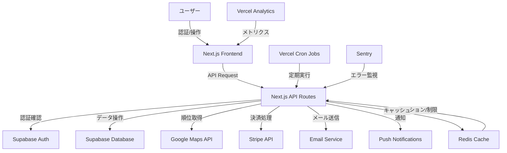

## ユーザー認証フロー

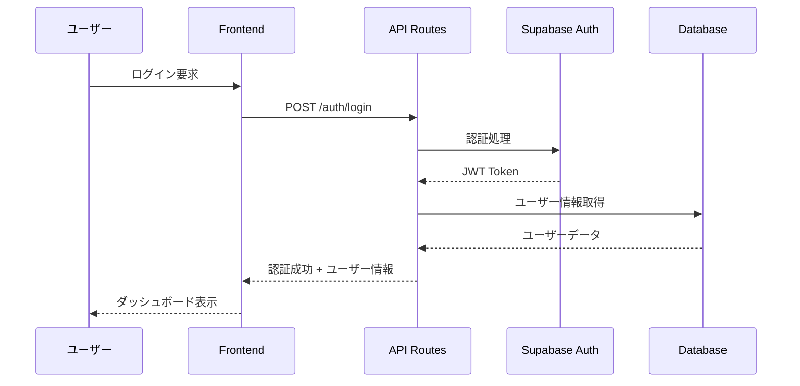

## キーワード管理フロー

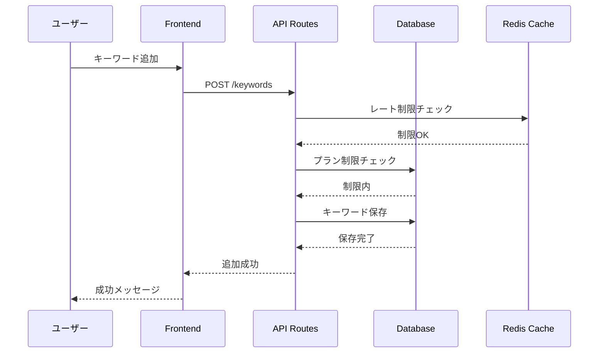

## 順位監視自動実行フロー

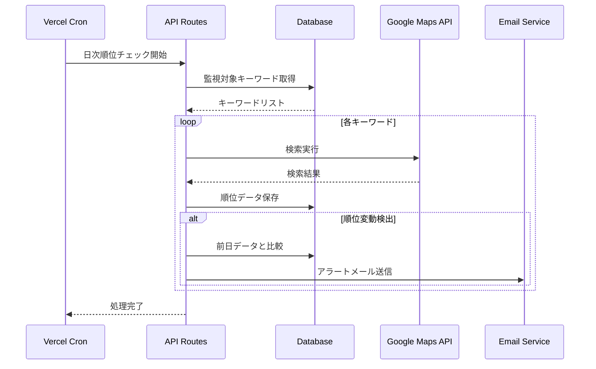

## 競合分析データ取得フロー

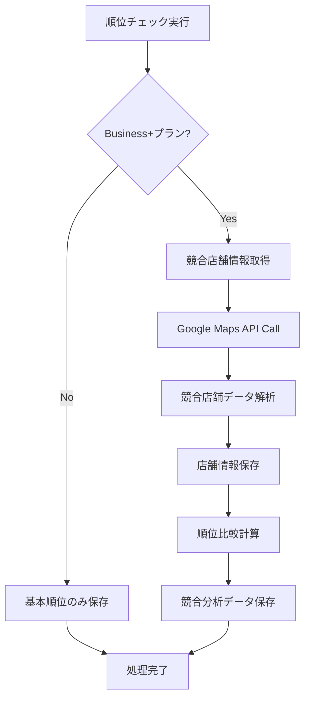

## 決済処理フロー

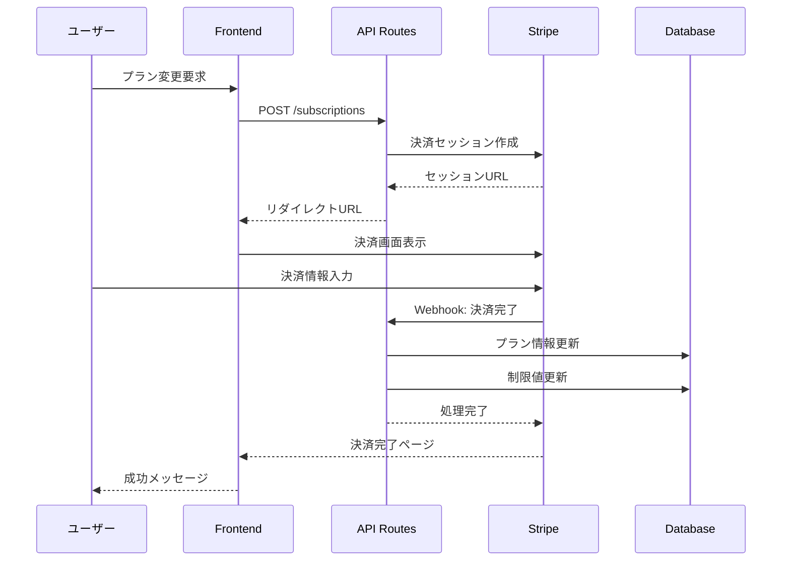

## データエクスポートフロー

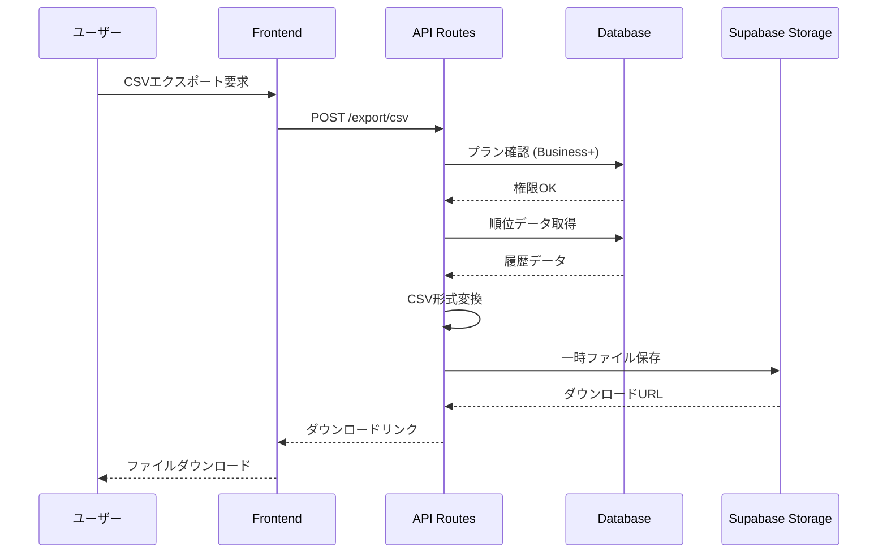

## リアルタイム通知フロー

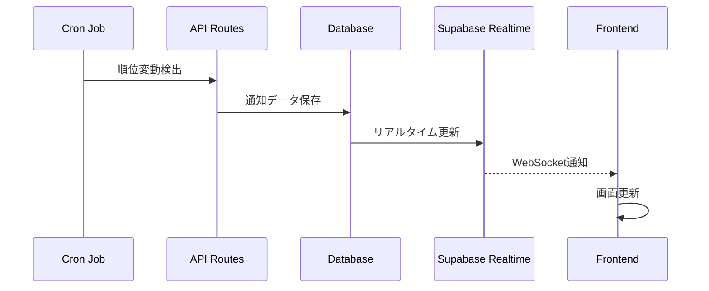

## エラーハンドリングフロー

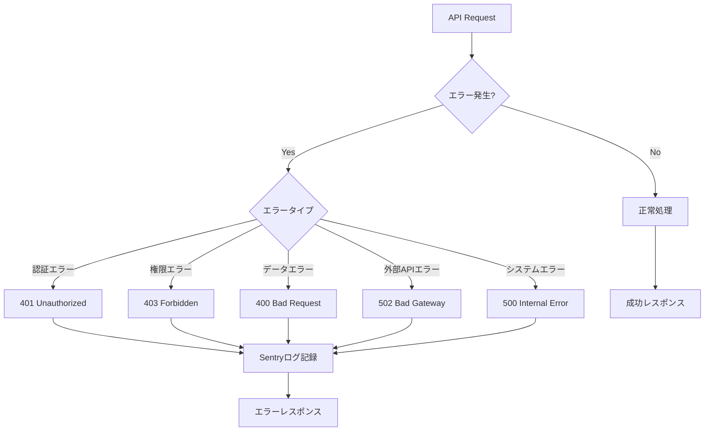

## キャッシュ戦略フロー

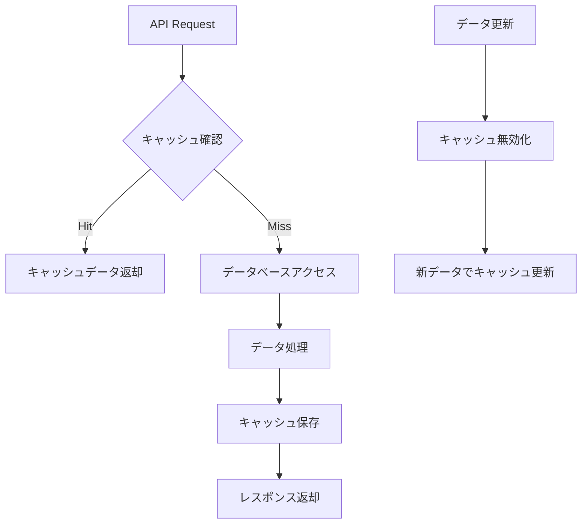

## データ保持・クリーンアップフロー

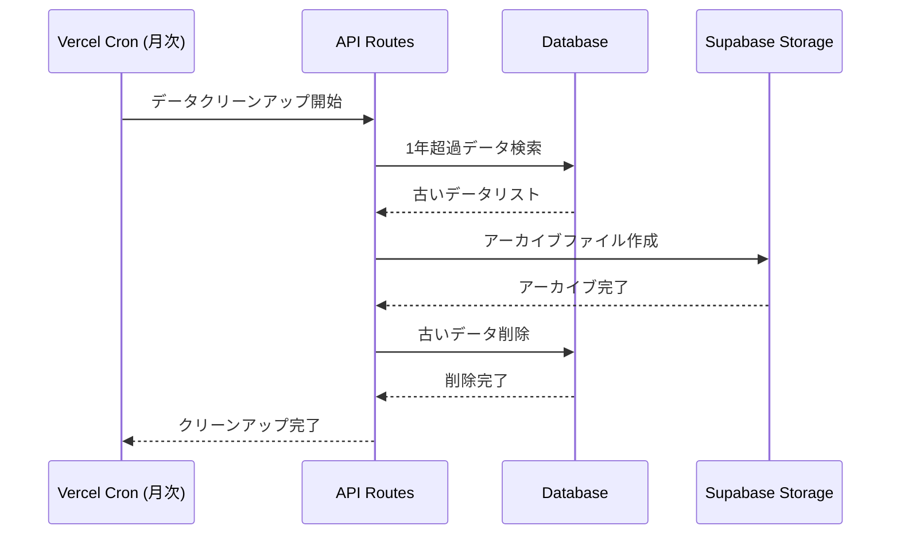

## 主要なデータフローの特徴

### パフォーマンス最適化
- Redis キャッシュによる高速レスポンス
- Supabase Realtime による効率的な更新通知
- 非同期バックグラウンド処理による応答性向上

### スケーラビリティ
- Vercel Edge Runtime による地理的分散処理
- データベース接続プールによる効率的なリソース利用
- 段階的なデータアーカイブによるパフォーマンス維持

### 信頼性
- 多層エラーハンドリング
- 自動リトライ機能
- 包括的なログとモニタリング