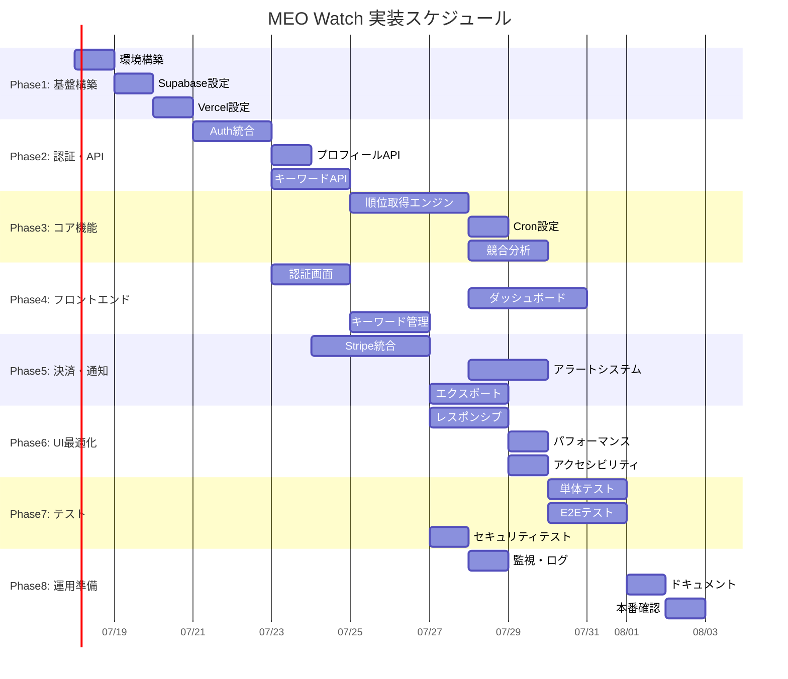

# MEO Watch 実装タスク

## 概要

**全タスク数**: 22タスク (通知機能除外により6タスク削減)
**推定作業時間**: 97時間 (約2.5-3週間)
**クリティカルパス**: TASK-001 → TASK-002 → TASK-003 → TASK-101 → TASK-201 → TASK-301 → TASK-401

## タスク一覧

---

## フェーズ1: 基盤構築 (Week 1)

### TASK-001: プロジェクト環境構築

- [ ] **タスク完了**
- **タスクタイプ**: DIRECT
- **要件リンク**: アーキテクチャ設計全般
- **依存タスク**: なし
- **実装詳細**:
  - Next.js 15プロジェクト初期化
  - TypeScript設定 (strict mode)
  - Tailwind CSS 4設定
  - ESLint/Prettier設定
  - Git pre-commit hooks設定
- **テスト要件**:
  - [ ] プロジェクトビルドテスト
  - [ ] Lintチェックテスト
- **完了条件**:
  - [ ] `npm run dev` でプロジェクトが起動する
  - [ ] `npm run build` でビルドが成功する
  - [ ] すべてのLintチェックがパスする

### TASK-002: Supabase プロジェクト設定

- [ ] **タスク完了**
- **タスクタイプ**: DIRECT
- **要件リンク**: REQ-005, アーキテクチャ設計
- **依存タスク**: TASK-001
- **実装詳細**:
  - Supabaseプロジェクト作成
  - データベーススキーマ実装 (docs/design/meo-watch/database-schema.sql)
  - RLS (Row Level Security) ポリシー設定
  - Supabase環境変数設定
- **テスト要件**:
  - [ ] データベース接続テスト
  - [ ] RLSポリシー動作確認
  - [ ] 全テーブル作成確認
- **完了条件**:
  - [ ] 13テーブルが正常に作成されている
  - [ ] RLSが有効になっている
  - [ ] Next.jsからSupabaseに接続できる

### TASK-003: Vercel デプロイ設定

- [x] **タスク完了**
- **タスクタイプ**: DIRECT
- **要件リンク**: アーキテクチャ設計
- **依存タスク**: TASK-001, TASK-002
- **実装詳細**:
  - Vercelプロジェクト作成
  - 環境変数設定 (Supabase, Stripe等)
  - GitHub自動デプロイ設定
  - Preview環境設定
- **テスト要件**:
  - [ ] 本番デプロイテスト
  - [ ] 環境変数読み込み確認
- **完了条件**:
  - [ ] GitHubプッシュで自動デプロイされる
  - [ ] HTTPS でアクセス可能
  - [ ] 環境変数が正常に読み込まれる

---

## フェーズ2: 認証・基本API (Week 1-2)

### TASK-101: Supabase Auth統合

- [ ] **タスク完了**
- **タスクタイプ**: TDD
- **要件リンク**: REQ-005
- **依存タスク**: TASK-002
- **実装詳細**:
  - Supabase Auth UI Components統合
  - JWT認証ミドルウェア実装
  - セッション管理 (httpOnly cookies)
  - 認証状態管理のProvider作成
- **テスト要件**:
  - [ ] 単体テスト: 認証ミドルウェア
  - [ ] 統合テスト: ログイン/ログアウトフロー
  - [ ] セキュリティテスト: JWT検証
- **UI/UX要件**:
  - [ ] ローディング状態: スピナー表示
  - [ ] エラー表示: トースト通知
  - [ ] モバイル対応: レスポンシブフォーム
  - [ ] アクセシビリティ: ARIA属性、キーボード操作
- **完了条件**:
  - [ ] ログイン/ログアウトが機能する
  - [ ] 認証状態がグローバルで管理される
  - [ ] 保護されたルートで認証チェックが動作する

### TASK-102: ユーザープロフィールAPI

- [ ] **タスク完了**
- **タスクタイプ**: TDD
- **要件リンク**: REQ-005
- **依存タスク**: TASK-101
- **実装詳細**:
  - `/api/profile` エンドポイント実装
  - プロフィール情報CRUD操作
  - バリデーション (Zod schemas)
- **テスト要件**:
  - [ ] 単体テスト: API エンドポイント
  - [ ] 統合テスト: プロフィール更新フロー
  - [ ] バリデーションテスト: 不正データ処理
- **完了条件**:
  - [ ] プロフィール取得/更新が機能する
  - [ ] 適切なエラーハンドリングがされている

### TASK-103: キーワード管理API

- [ ] **タスク完了**
- **タスクタイプ**: TDD
- **要件リンク**: REQ-001, REQ-007
- **依存タスク**: TASK-101
- **実装詳細**:
  - `/api/keywords` CRUD エンドポイント
  - プラン別キーワード数制限
  - Google Places API統合（place_id取得）
- **テスト要件**:
  - [ ] 単体テスト: CRUD操作
  - [ ] 統合テスト: プラン制限チェック
  - [ ] 外部APIテスト: Google Places連携
- **エラーハンドリング**:
  - [ ] キーワード数上限エラー
  - [ ] 重複キーワードエラー
  - [ ] Google API制限エラー
- **完了条件**:
  - [ ] キーワードCRUD操作が機能する
  - [ ] プラン別制限が正しく動作する
  - [ ] Google Places APIでplace_idが取得できる

---

## フェーズ3: コア機能実装 (Week 2-3)

### TASK-201: 順位取得エンジン

- [ ] **タスク完了**
- **タスクタイプ**: TDD
- **要件リンク**: REQ-001, REQ-002
- **依存タスク**: TASK-103
- **実装詳細**:
  - Google Maps API順位検索ロジック
  - `/api/rankings/check` エンドポイント
  - バックグラウンドジョブキュー実装
  - 順位データ保存処理
- **テスト要件**:
  - [ ] 単体テスト: 順位検索ロジック
  - [ ] 統合テスト: Google Maps API連携
  - [ ] パフォーマンステスト: 大量キーワード処理
- **エラーハンドリング**:
  - [ ] API制限超過
  - [ ] 検索結果なし（圏外）
  - [ ] タイムアウト処理
- **完了条件**:
  - [ ] Google Maps検索で順位が正確に取得できる
  - [ ] 順位データがデータベースに保存される
  - [ ] エラー時の適切な処理がされる

### TASK-202: Vercel Cron Jobs設定

- [ ] **タスク完了**
- **タスクタイプ**: DIRECT
- **要件リンク**: REQ-001
- **依存タスク**: TASK-201
- **実装詳細**:
  - `vercel.json` Cron設定 (毎日9時実行)
  - `/api/cron/daily-ranking-check` エンドポイント
  - バッチ処理ロジック実装
  - 実行ログ記録
- **テスト要件**:
  - [ ] Cron実行テスト
  - [ ] バッチ処理パフォーマンステスト
- **完了条件**:
  - [ ] 毎日決まった時間に順位チェックが実行される
  - [ ] 実行ログが記録される
  - [ ] エラー時の通知が機能する

### TASK-203: 競合分析機能 (Business+ プラン)

- [ ] **タスク完了**
- **タスクタイプ**: TDD
- **要件リンク**: REQ-003, REQ-102
- **依存タスク**: TASK-201
- **実装詳細**:
  - 競合店舗情報取得ロジック
  - `/api/keywords/[id]/competitors` エンドポイント
  - プラン制限チェック
- **テスト要件**:
  - [ ] 単体テスト: 競合分析ロジック
  - [ ] 統合テスト: プラン制限確認
  - [ ] データ整合性テスト
- **UI/UX要件**:
  - [ ] プランアップグレード促進UI
  - [ ] 競合データ視覚化
- **完了条件**:
  - [ ] Business+プランで競合分析が利用できる
  - [ ] 競合店舗情報が正確に取得される
  - [ ] プラン制限が適切に動作する

---

## フェーズ4: フロントエンド実装 (Week 2-3)

### TASK-301: 認証画面

- [ ] **タスク完了**
- **タスクタイプ**: TDD
- **要件リンク**: REQ-005
- **依存タスク**: TASK-101
- **実装詳細**:
  - ログイン/サインアップページ
  - Supabase Auth UIコンポーネント統合
  - 認証状態に基づくリダイレクト
- **UI/UX要件**:
  - [ ] ローディング状態: フォーム無効化 + スピナー
  - [ ] エラー表示: インラインエラーメッセージ
  - [ ] モバイル対応: レスポンシブレイアウト
  - [ ] アクセシビリティ: フォームラベル、エラー読み上げ
- **テスト要件**:
  - [ ] コンポーネントテスト: React Testing Library
  - [ ] E2Eテスト: ログインフロー
  - [ ] アクセシビリティテスト
- **完了条件**:
  - [ ] ログイン/サインアップが機能する
  - [ ] エラーハンドリングが適切
  - [ ] モバイル表示が適切

### TASK-302: ダッシュボード画面

- [ ] **タスク完了**
- **タスクタイプ**: TDD
- **要件リンク**: REQ-004
- **依存タスク**: TASK-103, TASK-201
- **実装詳細**:
  - メインダッシュボードレイアウト
  - 順位推移グラフ (Chart.js/Recharts)
  - キーワード一覧テーブル
  - 統計サマリーカード
- **UI/UX要件**:
  - [ ] ローディング状態: スケルトンUI
  - [ ] エラー表示: エラー境界コンポーネント
  - [ ] モバイル対応: カード型レイアウト
  - [ ] アクセシビリティ: グラフ代替テキスト
- **テスト要件**:
  - [ ] コンポーネントテスト: 各UI要素
  - [ ] データ表示テスト: モックデータ
  - [ ] レスポンシブテスト
- **完了条件**:
  - [ ] ダッシュボードが正しくデータを表示する
  - [ ] グラフが適切に描画される
  - [ ] モバイル表示が最適化されている

### TASK-303: キーワード管理画面

- [ ] **タスク完了**
- **タスクタイプ**: TDD
- **要件リンク**: REQ-001, REQ-007
- **依存タスク**: TASK-103
- **実装詳細**:
  - キーワード追加/編集フォーム
  - キーワード一覧テーブル
  - プラン制限表示
  - Google Places自動補完
- **UI/UX要件**:
  - [ ] フォームバリデーション: リアルタイム
  - [ ] ローディング状態: 保存中インジケーター
  - [ ] エラー表示: フィールド別エラー
  - [ ] モバイル対応: タッチ最適化
- **テスト要件**:
  - [ ] フォームバリデーションテスト
  - [ ] CRUD操作テスト
  - [ ] プラン制限UIテスト
- **完了条件**:
  - [ ] キーワードの追加/編集/削除が機能する
  - [ ] プラン制限が適切に表示される
  - [ ] Google Places自動補完が動作する

---

## フェーズ5: 決済・エクスポート機能 (Week 3-4)

### TASK-401: Stripe決済統合

- [ ] **タスク完了**
- **タスクタイプ**: TDD
- **要件リンク**: REQ-006
- **依存タスク**: TASK-101
- **実装詳細**:
  - Stripe Checkout Session作成
  - `/api/subscription` 関連エンドポイント
  - Webhook処理 (`/api/webhooks/stripe`)
  - サブスクリプション状態管理
- **テスト要件**:
  - [ ] 単体テスト: 決済ロジック
  - [ ] 統合テスト: Stripe連携
  - [ ] Webhookテスト: イベント処理
- **セキュリティ要件**:
  - [ ] Webhook署名検証
  - [ ] PCI DSS準拠
  - [ ] 機密情報暗号化
- **完了条件**:
  - [ ] プラン変更と決済が機能する
  - [ ] Webhookでサブスクリプション状態が更新される
  - [ ] セキュリティ要件を満たしている

### TASK-402: データエクスポート機能 (Business+ プラン) ※重要度UP

- [ ] **タスク完了**
- **タスクタイプ**: TDD
- **要件リンク**: REQ-102
- **依存タスク**: TASK-201, TASK-401
- **実装詳細**:
  - CSV/XLSX エクスポート処理 (JSON含む)
  - `/api/export` エンドポイント
  - Supabase Storage ファイル保存
  - ダウンロードURL生成
  - 高度なフィルタリング機能
- **テスト要件**:
  - [ ] エクスポート形式テスト (CSV, XLSX, JSON)
  - [ ] プラン制限テスト
  - [ ] ファイルサイズテスト
  - [ ] データ整合性テスト
- **UI/UX要件**:
  - [ ] エクスポート進行状況表示
  - [ ] ダウンロード期限表示
  - [ ] プランアップグレード案内
  - [ ] エクスポート履歴表示
- **完了条件**:
  - [ ] Business+プランで3形式エクスポートが利用できる
  - [ ] ファイルが正常にダウンロードできる
  - [ ] プラン制限が適切に動作する
  - [ ] ユーザーが独自の通知システムを構築できるデータ提供

---

## フェーズ6: UI/UX最適化 (Week 4)

### TASK-501: レスポンシブデザイン最適化

- [ ] **タスク完了**
- **タスクタイプ**: DIRECT
- **要件リンク**: NFR-201
- **依存タスク**: TASK-301, TASK-302, TASK-303
- **実装詳細**:
  - モバイルファーストデザイン適用
  - タブレット表示最適化
  - タッチ操作最適化
  - フォント・アイコンサイズ調整
- **テスト要件**:
  - [ ] デバイス別表示テスト
  - [ ] タッチ操作テスト
  - [ ] パフォーマンステスト
- **完了条件**:
  - [ ] 全画面がモバイル対応している
  - [ ] タッチ操作が快適
  - [ ] 読みやすいフォントサイズ

### TASK-502: パフォーマンス最適化

- [ ] **タスク完了**
- **タスクタイプ**: DIRECT
- **要件リンク**: NFR-001, NFR-002
- **依存タスク**: All UI tasks
- **実装詳細**:
  - Next.js Image最適化
  - コード分割最適化
  - バンドルサイズ最小化
  - キャッシュ戦略実装
- **テスト要件**:
  - [ ] Lighthouse性能テスト
  - [ ] バンドルサイズ測定
  - [ ] 読み込み速度テスト
- **完了条件**:
  - [ ] Lighthouseスコア90以上
  - [ ] 初期読み込み3秒以内
  - [ ] バンドルサイズ最適化

### TASK-503: アクセシビリティ対応

- [ ] **タスク完了**
- **タスクタイプ**: DIRECT
- **要件リンク**: NFR-202
- **依存タスク**: All UI tasks
- **実装詳細**:
  - ARIA属性設定
  - キーボードナビゲーション
  - スクリーンリーダー対応
  - 色コントラスト最適化
- **テスト要件**:
  - [ ] axe-core自動テスト
  - [ ] キーボード操作テスト
  - [ ] スクリーンリーダーテスト
- **完了条件**:
  - [ ] WCAG 2.1 AA準拠
  - [ ] キーボードのみで操作可能
  - [ ] スクリーンリーダー対応完了

---

## フェーズ7: テスト・品質保証 (Week 4-5)

### TASK-601: 単体テスト実装

- [ ] **タスク完了**
- **タスクタイプ**: TDD
- **要件リンク**: 全要件
- **依存タスク**: All implementation tasks
- **実装詳細**:
  - Jest/Vitest テストスイート
  - React Testing Library コンポーネントテスト
  - API エンドポイントテスト
  - ユーティリティ関数テスト
- **テスト要件**:
  - [ ] コードカバレッジ80%以上
  - [ ] 全APIエンドポイントテスト
  - [ ] 全Reactコンポーネントテスト
- **完了条件**:
  - [ ] すべてのテストがパスする
  - [ ] コードカバレッジ目標達成
  - [ ] CI/CDでテスト自動実行

### TASK-602: E2Eテスト実装

- [ ] **タスク完了**
- **タスクタイプ**: TDD
- **要件リンク**: 全要件
- **依存タスク**: All UI tasks
- **実装詳細**:
  - Playwright/Cypress セットアップ
  - 主要ユーザーフローテスト
  - 決済フローテスト
  - エラーシナリオテスト
- **テスト要件**:
  - [ ] ユーザー登録→ログインフロー
  - [ ] キーワード登録→順位確認フロー
  - [ ] プラン変更→決済フロー
  - [ ] アラート設定→通知受信フロー
- **完了条件**:
  - [ ] 全メインフローテスト完了
  - [ ] エラーケーステスト完了
  - [ ] CI/CDでE2E自動実行

### TASK-603: セキュリティテスト

- [ ] **タスク完了**
- **タスクタイプ**: DIRECT
- **要件リンク**: REQ-401, REQ-403, REQ-404
- **依存タスク**: TASK-401, TASK-101
- **実装詳細**:
  - OWASP ZAP 脆弱性スキャン
  - JWT トークンセキュリティテスト
  - SQL インジェクション対策確認
  - XSS対策確認
- **テスト要件**:
  - [ ] 脆弱性スキャン結果クリア
  - [ ] 認証・認可テスト
  - [ ] データ暗号化確認
- **完了条件**:
  - [ ] セキュリティ脆弱性なし
  - [ ] PCI DSS要件満たす
  - [ ] OWASP Top 10対策完了

---

## フェーズ8: 運用準備 (Week 5)

### TASK-701: 監視・ログ設定

- [ ] **タスク完了**
- **タスクタイプ**: DIRECT
- **要件リンク**: NFR-301
- **依存タスク**: TASK-003
- **実装詳細**:
  - Sentry エラー監視設定
  - Vercel Analytics 設定
  - アプリケーションログ実装
  - アラートルール設定
- **テスト要件**:
  - [ ] エラー監視動作確認
  - [ ] ログ出力確認
  - [ ] アラート通知確認
- **完了条件**:
  - [ ] エラーが自動的にSentryに送信される
  - [ ] アプリケーションログが記録される
  - [ ] 異常時にアラートが発火する

### TASK-702: ドキュメント作成

- [ ] **タスク完了**
- **タスクタイプ**: DIRECT
- **要件リンク**: 全要件
- **依存タスク**: All tasks
- **実装詳細**:
  - API仕様書更新
  - 運用マニュアル作成
  - ユーザーガイド作成
  - 開発者向けREADME更新
- **完了条件**:
  - [ ] API仕様書が最新
  - [ ] 運用手順が文書化
  - [ ] ユーザー向けヘルプ完備

### TASK-703: 本番環境最終確認

- [ ] **タスク完了**
- **タスクタイプ**: DIRECT
- **要件リンク**: 全要件
- **依存タスク**: All tasks
- **実装詳細**:
  - 本番環境動作確認
  - パフォーマンステスト
  - 負荷テスト実施
  - バックアップ・復旧手順確認
- **テスト要件**:
  - [ ] 本番環境で全機能動作確認
  - [ ] 想定負荷でのパフォーマンス確認
  - [ ] データバックアップ・復旧確認
- **完了条件**:
  - [ ] 本番環境で全機能正常動作
  - [ ] パフォーマンス要件満たす
  - [ ] 運用体制整備完了

---

## 実行順序

## 並行実行可能タスクグループ

### Week 1
- **並行実行**: TASK-102, TASK-103 (TASK-101完了後)

### Week 2-3
- **並行実行**: TASK-301, TASK-303 (認証・キーワードAPI完了後)
- **並行実行**: TASK-202, TASK-203 (TASK-201完了後)

### Week 3-4
- **並行実行**: TASK-401, TASK-402 (基本API完了後)
- **並行実行**: TASK-501, TASK-502, TASK-503 (UI実装完了後)

### Week 4-5
- **並行実行**: TASK-601, TASK-602 (実装完了後)

## マイルストーン

1. **Week 1 完了**: 基盤構築・認証システム完了
2. **Week 2 完了**: コア機能（順位取得）完了
3. **Week 3 完了**: フロントエンド基本機能完了
4. **Week 4 完了**: 決済・通知機能完了
5. **Week 5 完了**: 本番リリース準備完了

## 優先度

### 🔴 高優先度 (MVP必須)
- TASK-001～003 (基盤構築)
- TASK-101～103 (認証・基本API)
- TASK-201～202 (順位取得)
- TASK-301～303 (基本UI)

### 🟡 中優先度 (コア機能)
- TASK-203 (競合分析)
- TASK-401 (決済)
- TASK-402 (通知)

### 🟢 低優先度 (付加価値)
- TASK-403 (エクスポート)
- TASK-501～503 (UI最適化)
- TASK-601～603 (テスト強化)